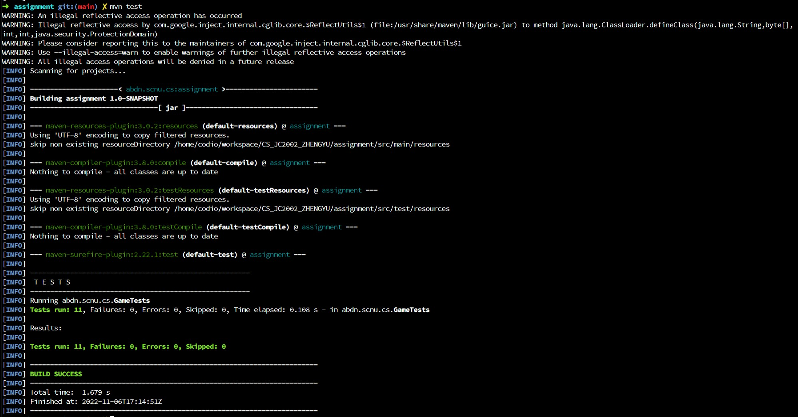
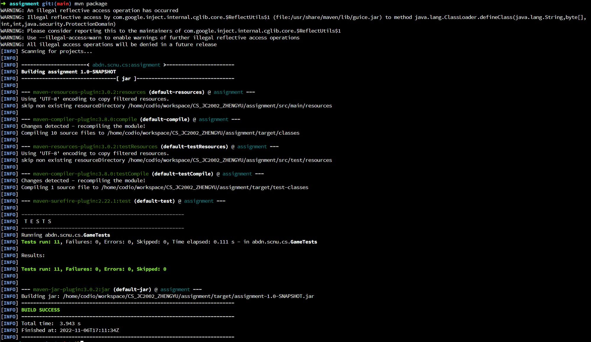

# Report

## Github link

[JavaAssignment](https://github.com/FaterYU/JavaAssignment)

## Task

test result:


package result:


### Task 1

Staus: **completed**

Outlining: create `BattleShip.java` and extends `AbstractBattleShip` class. In constructor, use Random object to defind the `shipOrientation` and init other params. Write the member functions which defind in `AbstractBattleShip`. Finish the `checkAttack` method. Check all possible situation. Defind a array `shipCoordinatesRecord` to record the coordinate which has been hit.


### Task 2

Staus: **completed**

Outlining: Create `GameGrid.java` anad extends `AbstarctGameGrid`. Create the `initializeGrid()`. Finish the `generateShips()`. Finish the `placeShip()`. Create `PlayerGameGrid.java` and `OpponentGameGrid.java`, extends `GameGrid`. Defind `printGrid()` in them.


### Task 3

Staus: **completed**

Outlining: Create `Game.java` and implement `GameControls`.create player's and opponent's grid and implement getter methods of them. Implement `exitGame()` method. Implement `checkVictory()`. Implement `playRound()` to make robot smart. In this case, oppenent decision depends on the probability which calculate from "X" coordinates. If all coordinates are less than or equal to 0, its decision depends on the probability which calculate from the number of unknown coordinates. Unfortunately, the fact is I will lose to the robot in most cases. Beyond that, it can be more smart when use RL(Reinforcement Learning) to make decision. If use RL, I prefer to use DQN(Deep Q-Network) that use neural network Q(s,a;w) to approximate Q*(s,a) and make the value-based decision. The environment is easily to create but RL is a little hard to applicate by java, which is esily to implement by C++ or python. Thus, I prefer to use probability algorithm instead of that.


### Task 4

Staus: **completed**

Outlining: Create `RunGame.java` and start it by create a `Game` object. Use params to get the height, hight and the number of ships. Use while loop function to make sure rounds are loop. Use regex `^[0-9]+,[0-9]+$` to match corret input. I create an `IOException` class to catch the exception and throw it. Use `exitGame()` function which in game object to check the `exit`.


### Task 5

Staus: **completed**

Outlining: Conclude the tasks status and desribe each with a short words.


## Fast Start

Switch to the JAVA project root directory `assignment`

- package the project

```shell
mvn package
```

- run the jar with you params which are **height**, **width** and **number of ships**

```shell
java -jar ./target/assignment-1.0-SNAPSHOT.jar 5 5 3
```

## Out of Task

In my opinion, the human-computer interaction interface is helpful because it is too hard to calculate the coordinates by eyes and hands when the width and height are both large. For this reason, I will improve it by adding GUI and dynamic refresh pattern. In addition, I will apply RL on opponent decision if I have enough time. 