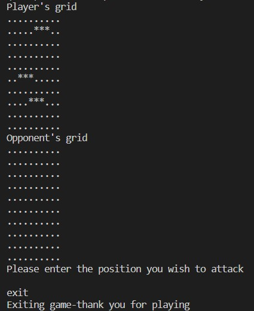
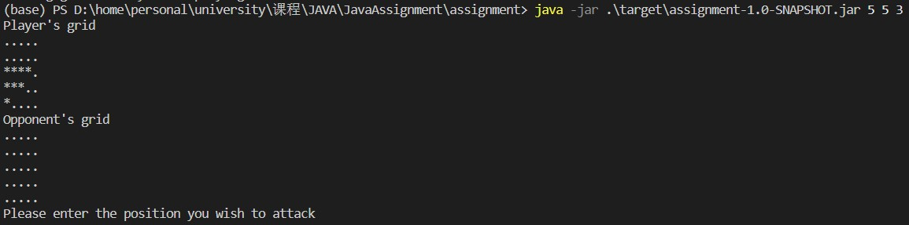
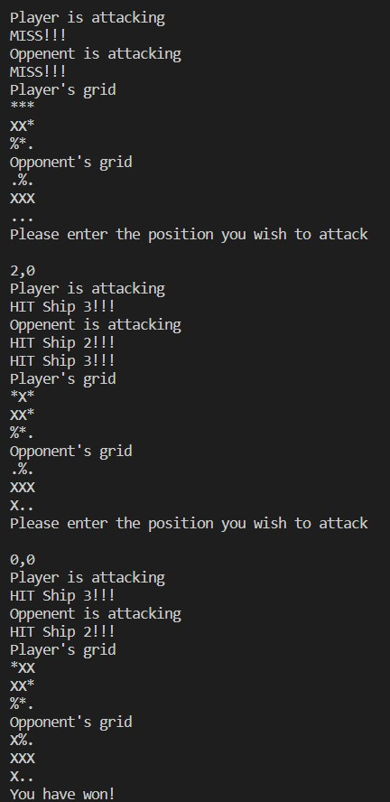
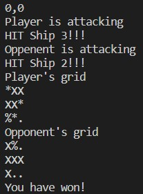
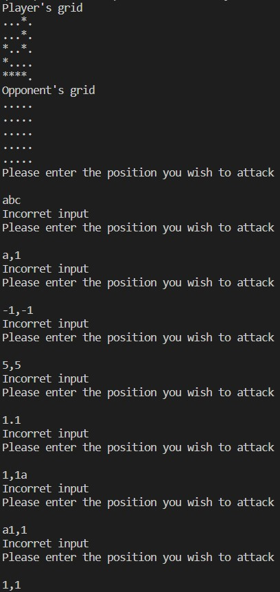

# JavaAssignment

Assignment of Java course

## Fast Start

Switch to the JAVA project root directory `assignment`

- package the project

```shell
mvn package
```

- run the jar with you params which are **height**, **width** and **number of ships**

```shell
java -jar .\target\assignment-1.0-SNAPSHOT.jar 5 5 3
```

## Task report

### Task 1:Create Battleship object

#### 1.1

Following the task require, create `BattleShip.java` and extends `AbstractBattleShip` class. In constructor, use Random object to defind the `shipOrientation` and init other params.

```java
...
public BattleShip(String name) {
    this.name = name;
    this.setHits(0);
    Random rand = new Random();
    this.shipOrientation = rand.nextBoolean() ? "vertical" : "horizontal";
}
...
```

#### 1.2

Following the task require, write the member functions which defind in `AbstractBattleShip`.

```java
...
public String getName() {
    return this.name;
}

public int getHits() {
    return this.hits;
}

public String getShipOrientation() {
    return this.shipOrientation;
}

public void setHits(int hits) {
    this.hits = hits;
}

public int[][] getShipCoordinates() {
    return this.shipCoordinates;
}

public void setShipCoordinates(int[][] shipCoordinates) {
    this.shipCoordinates = shipCoordinates;
}
...
```

#### 1.3

Finish the `checkAttack` method. Check all possible situation. Defind a array `shipCoordinatesRecord` to record the coordinate which has been hit.

```java
...
public boolean checkAttack(int row, int colum) {
    if (this.getHits() == 3) {
        return false;
    }
    int[] piont = new int[2];
    piont[0] = row;
    piont[1] = colum;
    for (int i = 0; i < this.shipCoordinates.length; i++) {
        if (this.shipCoordinates[i][0] == row && this.shipCoordinates[i][1] == colum) {
            for (int j = 0; j < this.shipCoordinatesRecord.size(); j++) {
                if (this.shipCoordinatesRecord.get(j)[0] == row && this.shipCoordinatesRecord.get(j)[1] == colum) {
                    return false;
                }
            }
            this.shipCoordinatesRecord.add(piont);
            this.hits++;
            return true;
        }
    }
    return false;
}
...
```

### Task 2:Implement the functionality to display the game grid

#### 2.1

Create `GameGrid.java` anad extends `AbstarctGameGrid`. Create the `initializeGrid()`.

```java
...
public GameGrid(int width, int high, int numberOfShips) {
    this.gameGrid = new String[width][high];
    this.ships = new BattleShip[numberOfShips];
    this.initializeGrid();
    this.generateShips(numberOfShips);
}

public void initializeGrid() {
    for (int i = 0; i < this.gameGrid.length; i++) {
        for (int j = 0; j < this.gameGrid[i].length; j++) {
            this.gameGrid[i][j] = ".";
        }
    }
}
...
```

#### 2.2

Finish the `generateShips()`.

```java
...
public void generateShips(int numberOfShips) {
    for (int i = 0; i < numberOfShips; i++) {
        BattleShip ship = new BattleShip("Ship " + (i + 1));
        this.ships[i] = ship;
        this.placeShip(ship);
    }
}
...
```

#### 2.3

Finish the `placeShip()`.

```java
...
public void placeShip(BattleShip ship) {
    int x_size = ship.getShipOrientation() == "vertical" ? this.gameGrid.length : this.gameGrid.length - 2;
    int y_size = ship.getShipOrientation() == "vertical" ? this.gameGrid[0].length - 2 : this.gameGrid[0].length;
    Random rand = new Random();
    int x = rand.nextInt(x_size);
    int y = rand.nextInt(y_size);
    int[][] shipCoordinates = new int[3][2];
    int time = 0;
    for (int i = x; i <= x + 2 * (ship.getShipOrientation() == "vertical" ? 0 : 1); i++) {
        for (int j = y; j <= y + 2 * (ship.getShipOrientation() == "vertical" ? 1 : 0); j++) {
            this.gameGrid[i][j] = "*";
            shipCoordinates[time][0] = i;
            shipCoordinates[time][1] = j;
            time++;
        }
    }
    ship.setShipCoordinates(shipCoordinates);
}
...
```

#### 2.4

Create `PlayerGameGrid.java` and `OpponentGameGrid.java`, extends `GameGrid`. Defind `printGrid()` in them.


```java
public class PlayerGameGrid extends GameGrid {
    
    public PlayerGameGrid(int width, int high, int numberOfShips) {
        super(width, high, numberOfShips);
    }

    public void printGrid() {
        for (int i = 0; i < this.gameGrid.length; i++) {
            for (int j = 0; j < this.gameGrid[i].length; j++) {
                System.out.print(this.gameGrid[i][j]);
            }
            System.out.println();
        }
    }

}
```

```java
public class OpponentGameGrid extends GameGrid {

    public OpponentGameGrid(int width, int high, int numberOfShips) {
        super(width, high, numberOfShips);
    }

    public void printGrid() {
        for (int i = 0; i < this.gameGrid.length; i++) {
            for (int j = 0; j < this.gameGrid[i].length; j++) {
                System.out.print(this.gameGrid[i][j] == "*" ? "." : this.gameGrid[i][j]);
            }
            System.out.println();
        }
    }
}
```

### Task 3:Create a menchanism for palying game in rounds and handling the attacks

#### 3.1

Create `Game.java` and implement `GameControls`.create player's and opponent's grid and implement getter methods of them.

```java
public class Game implements GameControls {
    PlayerGameGrid playerGameGrid;
    OpponentGameGrid opponentGameGrid;

    public Game(int width, int high, int numberOfShips) {
        this.playerGameGrid = new PlayerGameGrid(width, high, numberOfShips);
        this.opponentGameGrid = new OpponentGameGrid(width, high, numberOfShips);

    }
    ...
    public GameGrid getPlayersGrid() {
        return this.playerGameGrid;
    }

    public GameGrid getOpponentssGrid() {
        return this.opponentGameGrid;
    }
}
```

#### 3.2

Implement `exitGame()` method.

```java
...
public void exitGame(String input) {
    if (input.contains("exit")) {
        System.out.println("Exiting game - thank you for playing");
        System.exit(0);
    }
}
...
```

Result like this:


#### 3.3

Implement `checkVictory()`.

```java
...
public boolean checkVictory() {
    int opponentcount = 0;
    int playercount = 0;
    for (int i = 0; i < this.opponentGameGrid.ships.length; i++) {
        opponentcount += this.opponentGameGrid.ships[i].hits == 3 ? 1 : 0;
    }
    for (int i = 0; i < this.playerGameGrid.ships.length; i++) {
        playercount += this.playerGameGrid.ships[i].hits == 3 ? 1 : 0;
    }
    if (opponentcount == this.opponentGameGrid.ships.length && playercount < this.playerGameGrid.ships.length) {
        System.out.println("You have won!");
        return true;
    } else if (opponentcount < this.opponentGameGrid.ships.length
            && playercount == this.playerGameGrid.ships.length) {
        System.out.println("You have lost!");
        return true;
    } else {
        return false;
    }
}
...
```

#### 3.4

Implement `playRound()`.

```java
...
public void playRound(String input) {
    System.out.println("Player is attacking");
    String coordinates[] = input.split(",");
    int row = Integer.parseInt(coordinates[0]);
    int colum = Integer.parseInt(coordinates[1]);
    boolean isHit = false;
    for (int i = 0; i < this.opponentGameGrid.ships.length; i++) {
        if (this.opponentGameGrid.ships[i].checkAttack(row, colum)) {
            this.opponentGameGrid.gameGrid[row][colum] = "X";
            isHit = true;
            System.out.println("HIT " + this.opponentGameGrid.ships[i].name + "!!!");
        }
    }
    if (this.opponentGameGrid.gameGrid[row][colum] != "X") {
        this.opponentGameGrid.gameGrid[row][colum] = "%";
    }
    if (!isHit) {
        System.out.println("MISS!!!");
    }
    this.opponentRound();
    System.out.println("Player's grid");
    this.playerGameGrid.printGrid();
    System.out.println("Opponent's grid");
    this.opponentGameGrid.printGrid();
}
...
```

Make "bot" smarter

```java
...
private int[] decision() {
    int row = this.getPlayersGrid().gameGrid.length;
    int colum = this.getPlayersGrid().gameGrid[0].length;
    double[][] probability = new double[row][colum];
    for (int i = 0; i < row; i++) {
        for (int j = 0; j < colum; j++) {
            int u = i > 1 ? i - 2 : 0;
            int d = i < row - 2 ? i + 2 : row - 1;
            int l = j > 1 ? j - 2 : 0;
            int r = j < colum - 2 ? j + 2 : colum - 1;
            if (this.getPlayersGrid().gameGrid[i][j] == "X") {
                for (int k = u; k <= d; k++) {
                    if (k != i) {
                        probability[k][j] += (1d / 3) / Math.abs(k - i);
                    }
                }
                for (int k = l; k <= r; k++) {
                    if (k != j) {
                        probability[i][k] += (1d / 3) / Math.abs(k - j);
                    }
                }
            }
        }
    }
    for (int i = 0; i < row; i++) {
        for (int j = 0; j < colum; j++) {
            if (this.getPlayersGrid().gameGrid[i][j] == "X") {
                for (int x = -1; x < 2; x++) {
                    if (i + x > -1 && i + x < row) {
                        probability[i + x][j] += probability[i][j];
                    }
                }
                for (int x = -1; x < 2; x++) {
                    if (j + x > -1 && j + x < colum) {
                        probability[i][j + x] += probability[i][j];
                    }
                }
                probability[i][j] = Integer.MIN_VALUE;
            }
            if (this.getPlayersGrid().gameGrid[i][j] == "%") {
                probability[i][j] = Integer.MIN_VALUE;
            }
        }
    }
    int[] result = new int[] { 0, 0 };
    for (int i = 0; i < row; i++) {
        for (int j = 0; j < colum; j++) {
            if (probability[i][j] > probability[result[0]][result[1]]) {
                result[0] = i;
                result[1] = j;
            }
        }
    }
    if (probability[result[0]][result[1]] <= 0) {
        for (int i = 0; i < row; i++) {
            for (int j = 0; j < colum; j++) {
                int u = i > 1 ? i - 2 : 0;
                int d = i < row - 2 ? i + 2 : row - 1;
                int l = j > 1 ? j - 2 : 0;
                int r = j < colum - 2 ? j + 2 : colum - 1;
                double cot = 0;
                for (; u <= d; u++) {
                    if (this.getPlayersGrid().gameGrid[u][j] != "X" &&
                            this.getPlayersGrid().gameGrid[u][j] != "%"
                            && u != i) {
                        cot++;
                    }
                }
                for (; l <= r; l++) {
                    if (this.getPlayersGrid().gameGrid[i][l] != "X" &&
                            this.getPlayersGrid().gameGrid[i][l] != "%"
                            && l != j) {
                        cot++;
                    }
                }
                if (probability[i][j] >= 0) {
                    probability[i][j] = cot / 8;
                }
            }
        }
        for (int i = 0; i < row; i++) {
            for (int j = 0; j < colum; j++) {
                if (probability[i][j] > probability[result[0]][result[1]]) {
                    result[0] = i;
                    result[1] = j;
                }
            }
        }
    }
    return result;
}

private void opponentRound() {
    System.out.println("Oppenent is attacking");
    int[] decision = this.decision();
    int row = decision[0];
    int colum = decision[1];
    boolean isHit = false;
    for (int i = 0; i < this.playerGameGrid.ships.length; i++) {
        if (this.playerGameGrid.ships[i].checkAttack(row, colum)) {
            this.playerGameGrid.gameGrid[row][colum] = "X";
            isHit = true;
            System.out.println("HIT " + this.playerGameGrid.ships[i].name + "!!!");
        }
    }
    if (this.playerGameGrid.gameGrid[row][colum] != "X") {
        this.playerGameGrid.gameGrid[row][colum] = "%";
    }
    if (!isHit) {
        System.out.println("MISS!!!");
    }
}
...
```

### Task 4:Complete your code to implement remaining game controls

Create `Rungame.java` and start it by create a `Game` object.

```java
public class RunGame {
    private int width, high, numberOfShips;
    Game game;

    public RunGame(int width, int high, int numberOfShips) {
        this.width = width;
        this.high = high;
        this.numberOfShips = numberOfShips;
    }

    public void initial() {
        Game game = new Game(this.width, this.high, this.numberOfShips);
        System.out.println("Player's grid");
        game.playerGameGrid.printGrid();
        System.out.println("Opponent's grid");
        game.opponentGameGrid.printGrid();
        this.game = game;
    }

    public boolean checkInput(String ch) {
        String pattern = "^[0-9]+,[0-9]+$";
        if (!ch.matches(pattern)) {
            System.out.println("Incorret input");
            return false;
        } else {
            int row = Integer.parseInt(ch.split(",")[0]);
            int colum = Integer.parseInt(ch.split(",")[1]);
            if (row >= this.high || colum >= this.width) {
                System.out.println("Incorret input");
                return false;
            } else {
                return true;
            }
        }
    }

    public void gameLoop() {
        Scanner input = new Scanner(System.in);
        while (!this.game.checkVictory()) {
            System.out.println("Please enter the position you wish to attack\n");
            if (input.hasNextLine()) {
                String ch = input.nextLine();
                this.game.exitGame(ch);
                if (this.checkInput(ch)) {
                    this.game.playRound(ch);
                }
            }
        }
        input.close();
    }

    public static void main(String[] args) {
        RunGame runGame = new RunGame(Integer.parseInt(args[0]), Integer.parseInt(args[1]), Integer.parseInt(args[2]));
        runGame.initial();
        runGame.gameLoop();
    }
}
```

#### 4.1

Result like this:


#### 4.2

Apart of loop like this:


Full process like this:

```text
java -jar .\target\assignment-1.0-SNAPSHOT.jar 3 3 3
Player's grid
***
***
.*.
Opponent's grid
...
...
...
Please enter the position you wish to attack

1,1
Player is attacking
HIT Ship 1!!!
HIT Ship 2!!!
Oppenent is attacking
HIT Ship 1!!!
Player's grid
***
X**
.*.
Opponent's grid
...
.X.
...
Please enter the position you wish to attack

1,2
Player is attacking
HIT Ship 1!!!
HIT Ship 2!!!
Oppenent is attacking
MISS!!!
Player's grid
***
X**
%*.
Opponent's grid
...
.XX
...
Please enter the position you wish to attack

1,0
Player is attacking
HIT Ship 1!!!
HIT Ship 2!!!
HIT Ship 3!!!
Oppenent is attacking
HIT Ship 1!!!
HIT Ship 3!!!
Player's grid
***
XX*
%*.
Opponent's grid
...
XXX
...
Please enter the position you wish to attack

0,1
Player is attacking
MISS!!!
Oppenent is attacking
MISS!!!
Player's grid
***
XX*
%*.
Opponent's grid
.%.
XXX
...
Please enter the position you wish to attack

2,0
Player is attacking
HIT Ship 3!!!
Oppenent is attacking
HIT Ship 2!!!
HIT Ship 3!!!
Player's grid
*X*
XX*
%*.
Opponent's grid
.%.
XXX
X..
Please enter the position you wish to attack

0,0
Player is attacking
HIT Ship 3!!!
Oppenent is attacking
HIT Ship 2!!!
Player's grid
*XX
XX*
%*.
Opponent's grid
X%.
XXX
X..
You have won!
```

#### 4.3

Result like this:

- exit 
  
- win
  

#### 4.4

In `gameLoop()`, coordinates will be passed to `playRound` when it is correct

```java
...
public void gameLoop() {
    Scanner input = new Scanner(System.in);
    while (!this.game.checkVictory()) {
        System.out.println("Please enter the position you wish to attack\n");
        if (input.hasNextLine()) {
            String ch = input.nextLine();
            this.game.exitGame(ch);
            if (this.checkInput(ch)) {
                this.game.playRound(ch);
            }
        }
    }
    input.close();
}
...
```

#### 4.5

Result like this:


## Full Game

```text
Player's grid
*..
*..
*..
***
***
Opponent's grid
...
...
...
...
...
Please enter the position you wish to attack

1,1
Player is attacking
MISS!!!
Oppenent is attacking
HIT Ship 3!!!
Player's grid
*..
*..
X..
***
***
Opponent's grid
...
.%.
...
...
...
Please enter the position you wish to attack

2,1
Player is attacking
HIT Ship 3!!!
Oppenent is attacking
HIT Ship 3!!!
Player's grid
*..
X..
X..
***
***
Opponent's grid
...
.%.
.X.
...
...
Please enter the position you wish to attack

3,1
Player is attacking
HIT Ship 2!!!
Oppenent is attacking
MISS!!!
Player's grid
*..
X..
X%.
***
***
Opponent's grid
...
.%.
.X.
.X.
...
Please enter the position you wish to attack

4,1
Player is attacking
MISS!!!
Oppenent is attacking
HIT Ship 2!!!
Player's grid
*..
X..
X%.
X**
***
Opponent's grid
...
.%.
.X.
.X.
.%.
Please enter the position you wish to attack

3,0
Player is attacking
HIT Ship 2!!!
Oppenent is attacking
HIT Ship 2!!!
Player's grid
*..
X..
X%.
XX*
***
Opponent's grid
...
.%.
.X.
XX.
.%.
Please enter the position you wish to attack

2,0
Player is attacking
HIT Ship 3!!!
Oppenent is attacking
HIT Ship 2!!!
Player's grid
*..
X..
X%.
XXX
***
Opponent's grid
...
.%.
XX.
XX.
.%.
Please enter the position you wish to attack

2,2
Player is attacking
HIT Ship 3!!!
Oppenent is attacking
HIT Ship 1!!!
Player's grid
*..
X..
X%.
XXX
**X
Opponent's grid
...
.%.
XXX
XX.
.%.
Please enter the position you wish to attack

3,2
Player is attacking
HIT Ship 2!!!
Oppenent is attacking
HIT Ship 1!!!
Player's grid
*..
X..
X%.
XXX
*XX
Opponent's grid
...
.%.
XXX
XXX
.%.
Please enter the position you wish to attack

0,0
Player is attacking
HIT Ship 1!!!
Oppenent is attacking
HIT Ship 1!!!
Player's grid
*..
X..
X%.
XXX
XXX
Opponent's grid
X..
.%.
XXX
XXX
.%.
Please enter the position you wish to attack

2,0
Player is attacking
MISS!!!
Oppenent is attacking
MISS!!!
Player's grid
*..
X..
X%%
XXX
XXX
Opponent's grid
X..
.%.
XXX
XXX
.%.
Please enter the position you wish to attack

1,0
Player is attacking
MISS!!!
Oppenent is attacking
MISS!!!
Player's grid
*..
X%.
X%%
XXX
XXX
Opponent's grid
X..
%%.
XXX
XXX
.%.
Please enter the position you wish to attack

0,1
Player is attacking
HIT Ship 1!!!
Oppenent is attacking
HIT Ship 3!!!
Player's grid
X..
X%.
X%%
XXX
XXX
Opponent's grid
XX.
%%.
XXX
XXX
.%.
You have lost!
```